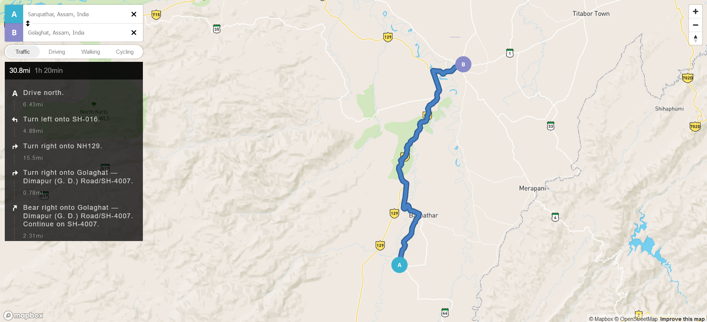

# Simple Map Project

A simple interactive map application inspired by Google Maps, allowing users to explore locations with zoom and pan features. This project demonstrates basic map functionality and can serve as a foundation for more advanced mapping applications.

## Features

- **Zoom Controls**: Easily zoom in and out to explore different areas.
- **Pan and Navigate**: Drag to move around the map seamlessly.
- **Markers**: Add custom markers to highlight points of interest (optional).

## Demo

[Live Demo](#) <!-- Replace with your actual demo link once available -->

## Installation

To get a local copy of this project up and running, follow these steps:

### 1. Clone the Repository

git clone https://github.com/your-username/your-repo.git
cd your-repo

### 2. Screenshoot

